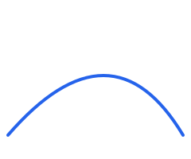
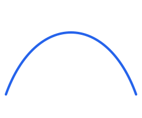
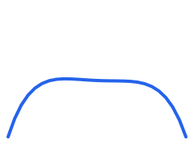
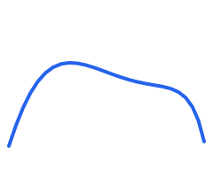
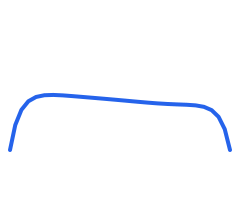

# SVG Curves

Run `php docs/examples/svg_curves.php` to regenerate these ready-to-inline `<svg>` snippets for each curve class.
Quadratic and cubic curves map directly to the `Q`/`C` path commands, while higher-order curves are rendered via the
`sampledPath()` helper in that example script.

## QuadraticCurve (`Q` command)



```php
$curve = new QuadraticCurve(
    new Point(10, 170),
    new Point(140, 20),
    new Point(230, 170),
);
$path = 'M 10 170 Q 140 20 230 170';
```

## CubicCurve (`C` command)



```php
$curve = new CubicCurve(
    new Point(10, 160),
    new Point(60, 20),
    new Point(180, 20),
    new Point(230, 160),
);
$path = 'M 10 160 C 60 20 180 20 230 160';
```

## QuarticCurve (sampled polyline)



```php
$curve = new QuarticCurve(
    new Point(10, 170),
    new Point(60, 10),
    new Point(120, 190),
    new Point(180, 20),
    new Point(230, 170),
);
$path = sampledPath($curve); // see docs/examples/svg_curves.php
```

## QuinticCurve (sampled polyline)



```php
$curve = new QuinticCurve(
    new Point(10, 165),
    new Point(50, 40),
    new Point(90, 10),
    new Point(150, 190),
    new Point(200, 20),
    new Point(230, 160),
);
$path = sampledPath($curve);
```

## NOrderCurve (degree 6, sampled)



```php
$curve = new NOrderCurve(
    new Point(10, 150),
    new Point(30, 20),
    new Point(70, 180),
    new Point(120, 10),
    new Point(170, 190),
    new Point(210, 40),
    new Point(230, 150),
);
$path = sampledPath($curve);
```

